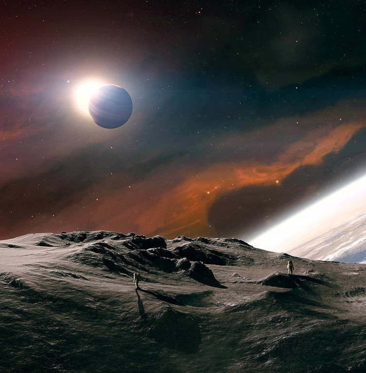
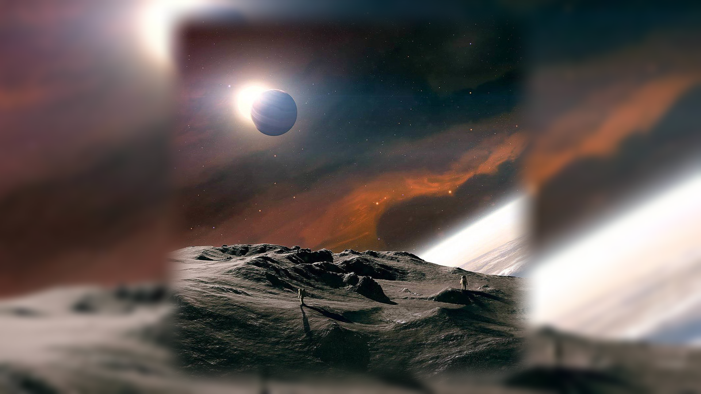

## Adjust Images
Adjust Images 是一个通过为图片添加高斯模糊背景，将各种比例的图片转成统一分辨率的
工具。

方便用于：
    - 图片素材制作
    - 统一分辨率壁紙制作

处理前的原图

处理后的图片

### Features
- 支持自定义背景模糊等级
- 支持自定义淡入深度

### Dependencies
- Python (>= 3.1)
- numpy
- PIL
- PyQt5
